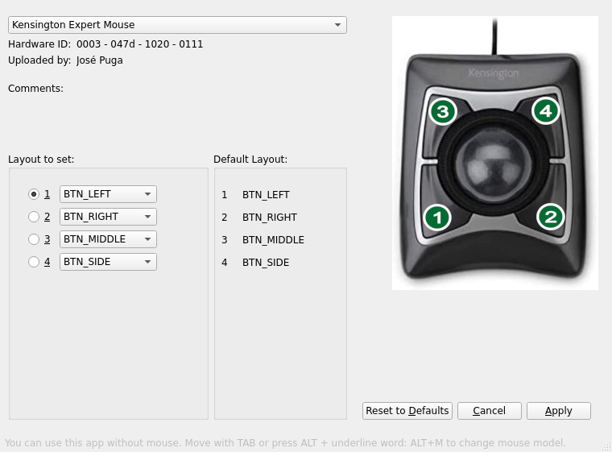

# QMice Remap

## IMPORTANT: This App only works on Wayland

Remap the buttons of your mouse under GNU/Linux.

[English doc](doc/README.md)

[Documentación en Español](doc/LEEME.md)

Some samples screenshots:

[App Icon created by Freepik - Flaticon. (thanks so much!)](https://www.flaticon.com/free-icons/setup)
