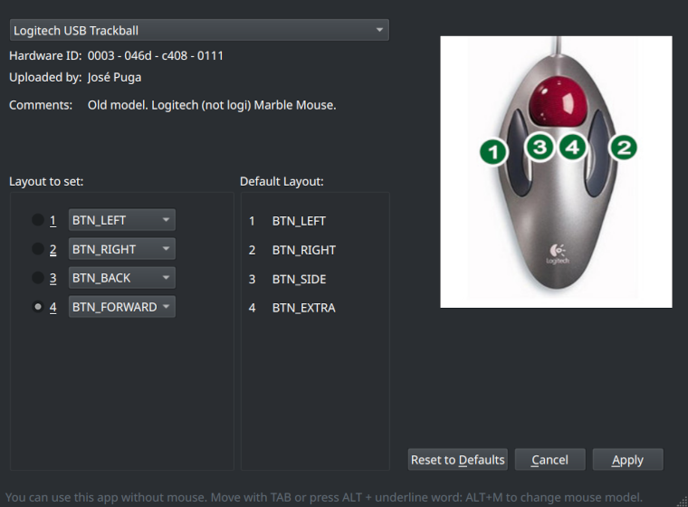
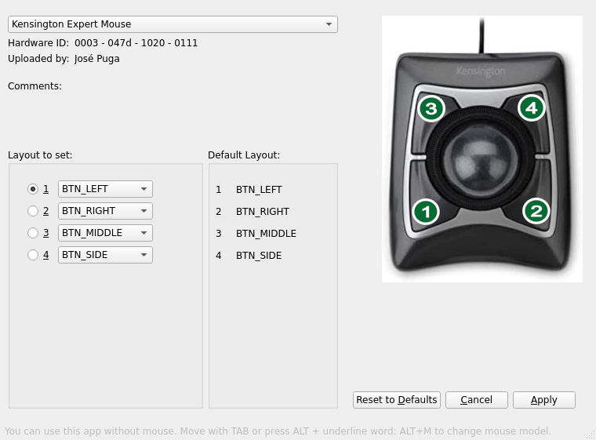

# QMice Remap

## IMPORTANTE: Esta App sólo funciona en Wayland

### He creado esta app, para que los usuarios de Linux tengamos una forma sencilla y gráfica de poder mapear los botones del ratón, esto es especialmente útil en los trackball, que suelen tener una distribución muy absurda por defecto. No es justo que los usuarios de Windows tengan sus interfaces gráficas creadas por los fabricantes y los usuarios Linux nos veamos obligados a teclear decenas de comandos. NO TODO EL MUNDO TIENE QUE SER UN ADMINISTRADOR DE SISTEMAS

#### Para resolución de problemas mira [aquí.](./troubleshooting-ES.md)

QMice no puede leer (de momento) los datos de los ratones del sistema. En su lugar funciona con perfiles, que son ficheros .conf creados por usuarios. Contienen los datos hardware de un determinado ratón para que el Kernel pueda acceder a él y "remapearlo".

- **Si tu ratón no está en la lista** puedes hacer este proceso manualmente con comandos de consola tal y como se explica en la siguiente página (en inglés). <https://askubuntu.com/questions/1145057/remapping-mouse-buttons-to-keyboard-keysXXX>.

Si con dicha página consigues remapear tu ratón, **puedes crear un perfil para que otros usuarios se beneficien de ello**. Tienes un tutorial de cómo hacerlo [aquí.](./tutorial-create-profile-ES.md)

- **Si tu ratón está en la lista...**

Tienes en la parte derecha el layout (distribución) que tiene el ratón por defecto y en la parte izquierda, cómo quieres que quede esa distribución. Aunque ya esté cambianda anteriormente, QMice no lo detecta (de momento), así que te aparece también la distribución por defecto.

Selecciona en la lista de la izquierda cómo quieres asignar tus botones y pulsa "Aplicar".

"Reset to Defaults", deja la lista de la izquierda con el valor por defecto. Puedes a continuación pulsar "Aplicar" para dejar el ratón con los valores de fábrica.
