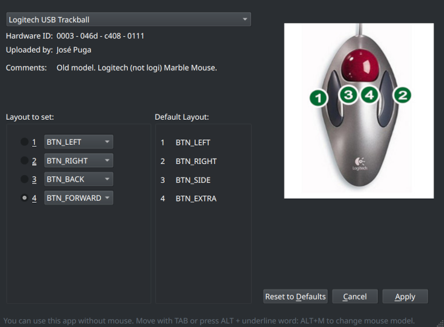

# QMice Remap

## IMPORTANT: This App only works on Wayland

### I have created this app so that Linux users have a simple and graphic way to map their mouse buttons. This is especially useful for trackballs, which usually have a very absurd layout by default. It is not fair that Windows users have their graphical interfaces created by manufacturers and Linux users are forced to type dozens of commands. NOT EVERYONE HAS TO BE A SYSTEMS ADMINISTRATOR

#### For troubleshooting look [here.](./troubleshooting-EN.md)

QMice cannot (yet) read data from system mouses. Instead it works with profiles, which are .conf files created by users. They contain the hardware data of a specific mouse. In this way, the Kernel can access it and "remap" it.

- **If your mouse is not on the list** you can do this process manually with console commands as explained on the next page . <https://askubuntu.com/questions/1145057/remapping-mouse-buttons-to-keyboard-keysXXX>.

If with this page you manage to remap your mouse, you can create a profile so that other users can benefit from it. You have a tutorial on how to do it [here.](./tutorial-create-profile-EN.md)

- **If your mouse is on the list..**

On the right side you have the layout that the mouse has by default and on the left side, how you want that layout to be. Although it has already been changed previously, QMice does not detect it (yet), so the default distribution also appears.

Select how you want to assign your buttons and press "Apply".

"Reset to Defaults", leaves the left list with the default values. You can then press "Apply" to leave the mouse at factory settings.
