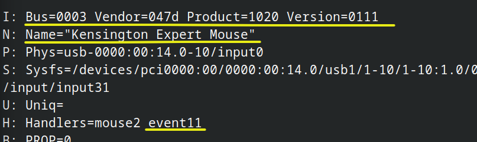
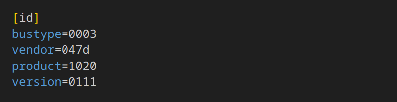
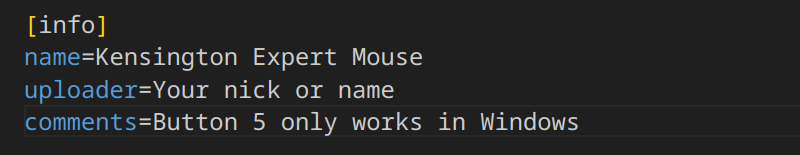
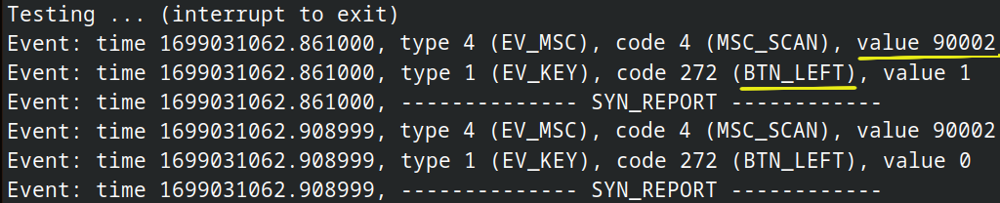
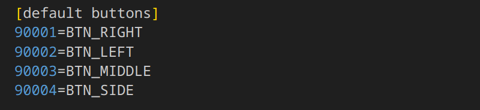

# Tutorial: How to create a mouse profile

## If you want other people in the community to benefit from your work, you can create a profile of your mouse and upload it

In this tutorial, we are going to create a profile for the Kensington Expert Mouse as sample.

## The 'easy' part

Open with your favorite editor the **template.profile** file. <http://github.com/josepuga/qmice-remap/assets/template.profile>

Open a system console.

```bash
cat /proc/bus/input/devices > /tmp/devices.logs
```

Open /tmp/devices.log and search until you see your device. In this case:



The only important data is the yellow one.

Copy Bus, Vendor, Product and Version to **template.profile**.



On info section:

- The device name.
- (optional). Your name as uploader.
- (optional). Any comment about the device. I.e. Button 5 only works in Windows. (I'm jocking, this model only has 4 buttons). The comment should be in ONLY ONE LINE.



## The 'hard' part

Now we need to backup the default buttons configuration before any mapping. The utility **evtest** must be installed on your system. Another command in the system console:

```bash
sudo evtest
```


Evtest is asking what event to handle. **Is the event number in devices.logs before**. In this case 11. Type the number and now you will enter in an interactive mode. Click all your buttons one by one, and anotatte any event in the **default buttons** section in **template.profile**. (In order from smallest value to biggest **THIS IS VERY IMPORTANT**).





## The 'funny' part

I want to maintain only one file per profile. However, how to inform the users about the button numbers when setting up?

Download a picture of the product. Resize to no more than 256x340 (proporción 3:4) and number the buttons. You can use your distro default image editor and do something like that:


Or if you have more skills editing images with Gimp or Krita, you can use the images numbers inside **assets/numbers/** on GitHub to create a more sophisticated image:


Less size is better, so save as jpg. The next step is to encode the image to base64. There are a lot of pages that do that online. [Base64 Guru](https://base64.guru/converter/encode/image/png) is one of them.

Upload the picture and encode it.Copy the result text, and paste on gui section, next to image=


## Final: Copying and publishing the file

Rename the template to other name and copy it to your **$HOME/.config/pugamice-remap/**. The name is up to you. The extension must be **.profile**. However, to avoid name conflicts. I suggest use the formula bus-vendor-product-version: 0003-047d-1020-0111.profile

At this time I dont have any repository, and I don't think it's necessary for every user to have a GitHub account to send the file like a post.

Send me if you like to:


