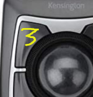

# Tutorial: How to create a mouse profile

## If you want other people in the community to benefit from your work, you can create a profile of your mouse and upload it

In this tutorial, we are going to create a profile for the Kensington Expert Mouse as sample.

Wen finish, copy the profile to your **$HOME/.config/qmice-remap/profiles** directory.

## Getting the device number

Linux assign an unique id to every device. Not always is the same, it could change after reboot. We need to know wich device number has our mouse. Open a system console:

```bash
sudo evtest
```


The program shows a list with all your devices. Take note of your mouse id (in our example is 11). We can exit pressing CTRL+C

## The 'easy' part

A shell script will do almost all the job. Download it from <https://github.com/josepuga/qmice-remap/blob/main/scripts/create-profile.sh>

The script needs sudo privileges and will check all requisites before start. **Change de number 11 for your device id**.

```bash
sudo ./create-profile.sh 11
```


Click your mouse buttons. Don't worry if you repeat some of them. Is more important **to not press 2 or more together**. At the end check if the number buttons recorded is the same of your mouse buttons.

Open with your favorite editor the file generated on /tmp


There are few things to do:

- (optional). **uploader=** Type your nick or name.
- (optional). **comment=** Any necessary comment about the device. The comment should be in only one line. Other lines will be ignored.
- **image=** This parameter is mandatory as I explain in the next section.

---

> **_NOTE:_** There is no magic way to know wich one is your button number 1, 2, 3, ... The numbers inside **[default buttons]** could be 90007, 90023 or whatever. Leave the list sorted, and set the button 1 the fist line, and so on. Its easy to match with your real mouse because every BTN_XXX tag is different (In the sample are 2 equals because has been remaped before)

## The 'funny' part

I want to maintain only one file per profile. However, how to inform the users about the button numbers when setting up?

Download a picture of the product. Resize to no more than 256x340 (proporción 3:4) and number the buttons. You can use your distro default image editor and do something like that:



Or if you have more skills editing images with Gimp or Krita, you can use the images numbers inside **assets/numbers/** on GitHub to create a more sophisticated image:


Less size is better, so save as jpg. The next step is to encode the image to base64. There are a lot of pages that do that online. [Base64 Guru](https://base64.guru/converter/encode/image/png) is one of them.

Upload the picture and encode it.Copy the result text, and paste on gui section, next to image=


## Final: Copying and publishing the file

Copy it to **$HOME/.config/qmice-remap/profiles**. The extension must be **.profile**. To avoid name conflicts. I suggest use the name bus-vendor-product-version: 0003-047d-1020-0111.profile

At this time I dont have any repository, and I don't think it's necessary for every user to have a GitHub account to send the file like a post.

Send me if you like to:


